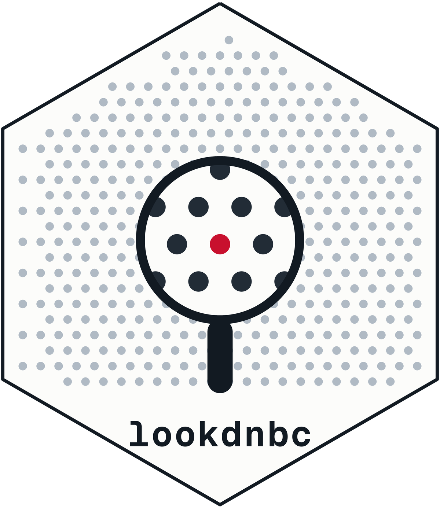

# lookdnbc 

**Find DNBC variables by topic.** A skill for [Claude Code](https://claude.com/claude-code) that searches the **Danish
National Birth Cohort** questionnaire codebooks. Ask a question in plain English and get
back the matching variables, grouped by wave, each with its **variable code**, the
**question as it was actually asked**, and **every answer label**.

It is meant for the part of a project where you are staring at eight codebooks trying to
work out which columns to pull and how they are coded.

> **you:** which DNBC variables cover breastfeeding?

```
## Interview 3 (postnatal, ~6 months)
   C001       p43   Do you breastfeed your boy/girl now?  [gates 83]
              = 1=Yes · 2=No · 3=No, but the child gets mother's milk, from own mother
                · 4=No, but child gets mother's milk from another woman
                · 5=The child was never breast-fed   missing: 6,7,9,10

## Interview 4 (postnatal, ~18 months)
   R011       p7    Within the last month, did he/she have anything else but breast
                    milk substitute in the bottle?  [gates 39]
              = 1=No · 2=Yes   missing: 3,4,9,10
              ! REVERSED: 1=no, 2=yes -- the opposite of most DNBC items
```

Three things that page shows you, which a PDF search will not:

- **`[gates 83]`** — answering `C001` opens up 83 further questions. Skip patterns are
  reconstructed across the whole questionnaire, so you can see what a variable unlocks
  and what it depends on.
- **`missing: 6,7,9,10`** — the codes that are *not* substantive answers ("do not know",
  "irrelevant"), separated from the real levels so they don't silently become data.
- **`! REVERSED`** — a coding trap. 120 variables are coded `1=No 2=Yes`, the opposite of
  the convention used elsewhere in the DNBC. Miss one and an effect flips sign.

---

## What's covered

7,989 variables from all eight questionnaire waves:

| Wave | Variables | Codes |
|------|----------:|-------|
| Interview 1 — prenatal, ~12 wk gestation | 980 | `A` |
| Interview 2 — prenatal, ~30 wk gestation | 2,365 | `B` |
| Interview 3 — postnatal, ~6 months | 2,162 | `C`, `P` |
| Interview 4 — postnatal, ~18 months | 801 | `D`, `S`, `R`, `O`, `T` |
| 7-year follow-up | 285 | `Z` |
| 11-year follow-up — child self-report | 342 | `E` |
| 11-year follow-up — adult/parent report | 745 | `F` |
| 18-year follow-up | 309 | `G` |

Questionnaires only. Registry-linked data (birth weight, income, clinical diagnoses)
lives elsewhere and is not in here — the skill will tell you when a concept falls on that
side of the line rather than pretending it doesn't exist.

---

## Setup

Two steps, about five minutes, and you only do it once.

### Step 1 — Install Python

The skill runs a small Python script. Nothing else is needed: **no `pip`, no packages, no
particular version.** Any Python 3 works.

<details open>
<summary><b>macOS</b></summary>

Most Macs already have it. Open **Terminal** (`Cmd` + `Space`, type `Terminal`, Enter),
paste this and press Enter:

```bash
python3 --version
```

| What happens | What to do |
|---|---|
| Prints e.g. `Python 3.9.6` | You're done — go to Step 2. |
| A box offers to install *"command line developer tools"* | Click **Install** and wait. This is normal, and it installs `git` too, which you need next. Then run the command again. |
| Anything else | Install from [python.org/downloads](https://www.python.org/downloads/). |

</details>

<details open>
<summary><b>Windows</b></summary>

The easiest route, and it needs **no admin rights**:

1. Open the **Microsoft Store**
2. Search for **Python 3**
3. Click **Install** on the newest version

<sub>Prefer the installer from [python.org](https://www.python.org/downloads/)? On the
very first screen you **must tick "Add python.exe to PATH"** before clicking Install.
Forgetting that box is the single most common reason this fails later.</sub>

Check it worked — open **PowerShell** (Start button, type `PowerShell`, Enter):

```powershell
py -3 --version
```

A version number means you're set.

</details>

### Step 2 — Install the skill

You also need **git**. On macOS it arrives with the developer tools from Step 1; on
Windows get it from [git-scm.com](https://git-scm.com/download/win) — all default options
are fine. *(No git? See [Installing without git](#installing-without-git).)*

**macOS** — in Terminal:

```bash
git clone https://github.com/alkat19/dnbc_skills.git ~/.claude/skills/lookdnbc
```

**Windows** — in PowerShell:

```powershell
git clone https://github.com/alkat19/dnbc_skills.git $env:USERPROFILE\.claude\skills\lookdnbc
```

Then **restart Claude Code**.

### Step 3 — Check it works

Ask Claude:

> which DNBC variables cover breastfeeding?

If you get variables grouped by wave with their answer options, you're finished. There are
no commands to memorise — just describe the topic in normal language.

---

## Things to ask it

```
which variables cover maternal smoking during pregnancy?
what does A031_5 mean?
show me the depression items in the 11-year follow-up
which waves ask about childcare arrangements?
I need breastfeeding duration — what are my options and how are they coded?
give me the sleep variables at age 7 as a table
```

It also knows 18 curated topic maps — `alcohol`, `allergy`, `anxiety`, `birth`,
`breastfeeding`, `childcare`, `depression`, `diet`, `education`, `infection`,
`medication`, `occupation`, `pregnancy`, `sleep`, `smoking`, `socioeconomic`, `stress`,
`weight` — so those searches use terms checked against the real codebook wording rather
than guessed synonyms.

---

## Staying up to date

**macOS**

```bash
git -C ~/.claude/skills/lookdnbc pull
```

**Windows**

```powershell
git -C $env:USERPROFILE\.claude\skills\lookdnbc pull
```

---

## Known limitations

**Some grid questions are missing.** A few codebook questions are printed as a matrix,
with codes inside the table rather than at the start of a line — the parental
lifestyle-health grid (`Z112*`, `Z113*`) is the main case. Those cells have no dictionary
row. If a code lookup comes back empty, ask Claude to check the codebook text directly;
the grid is perfectly readable there.

**Not every description is verbatim.** 4,205 of the entries were lifted straight off the
page. The remaining 3,784 are codes the codebook mentions only in passing — members of a
folded range like `A031_1-A031_40`, or sub-codes listed inside a parent question's text.
The variable codes are real, but the wording is inherited from the parent, and the skill
marks these with `~` so you know to confirm before quoting one in a paper.

---

## Troubleshooting

**`python3: command not found` / `Python was not found`**
Step 1 didn't complete. On Windows this usually means *"Add python.exe to PATH"* was not
ticked — reinstall and tick it, or use the Microsoft Store version.

**On Windows, typing `python` opens the Microsoft Store**
That's a placeholder Windows ships when Python isn't installed. Use `py -3`, or install
Python from the Store.

**Claude doesn't seem to know about the skill**
`SKILL.md` must sit *directly* inside the `lookdnbc` folder — so
`~/.claude/skills/lookdnbc/SKILL.md` on macOS, or
`%USERPROFILE%\.claude\skills\lookdnbc\SKILL.md` on Windows. Then restart Claude Code.

**A variable looks wrong, or one you expect is missing**
Please [open an issue](https://github.com/alkat19/dnbc_skills/issues) with the variable
code — that's the fastest way to get it fixed for everyone.

### Installing without git

Click the green **Code** button above → **Download ZIP**. Unzip it, rename the folder to
`lookdnbc`, and move it into your skills folder:

- **macOS** — in Finder press `Cmd` + `Shift` + `G`, type `~/.claude/skills`, press Enter,
  drag the folder in. *(`.claude` is hidden, hence the Go-to-Folder shortcut.)*
- **Windows** — in File Explorer's address bar type `%USERPROFILE%\.claude\skills`, press
  Enter, drag the folder in.

You'll have to repeat this for every update, which is why the one-time git setup pays off.

---

## What's in this repository

| Path | What it is |
|------|-----------|
| `SKILL.md` | The instructions Claude reads |
| `references/dnbc_variables.tsv` | The variable dictionary — one variable per line |
| `references/topics.tsv` | The curated topic → search-term maps |
| `references/text/` | Clean full text of each codebook, for context lookups |
| `scripts/search.py` | The search tool (Python standard library only) |

The dictionary and the search tool are covered by an 87-test regression suite, kept in a
separate maintainer repository along with the codebook extractor that builds the
dictionary from the published PDFs.

## Data source

The questionnaire codebooks are published by the Danish National Birth Cohort at
[dnbc.dk](https://www.dnbc.dk/). This repository contains text extracted from those public
codebooks, reorganised into a searchable dictionary. The underlying content belongs to the
DNBC — please cite the cohort, not this tool, in any publication.
